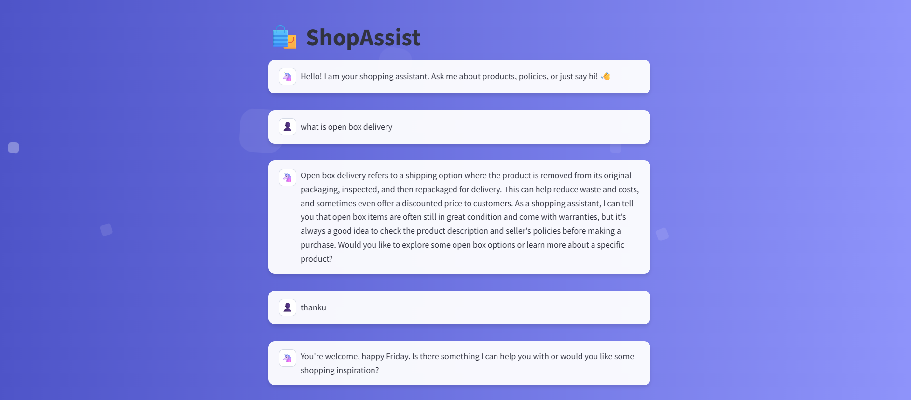

# 💬 E-commerce chatbot (Gen AI RAG project using LLama3.3 and GROQ)

An intelligent e-commerce assistant that understands customer intent, answers FAQs, and runs live product queries against your store database.  

It uses a semantic router to classify user intent into three distinct flows: a RAG-based FAQ system for policy questions, an LLM-to-SQL engine for real-time product discovery, and a conversational agent for general chitchat.

Built with Llama 3.3 via Groq, Streamlit, ChromaDB, SQLite, and Hugging Face embeddings.

---

## This chatbot currently supports three intents:
- **faq**: Triggered when users ask questions related to the platform's policies or general information. eg. Is online payment available?
- **sql**: Activated when users request product listings or information based on real-time database queries. eg. Show me all nike shoes below Rs. 3000.
- **chit-chat**: Activated when users just want to converse with the bot. eg. Hii,how are you?



---

## Folder structure

GenAI_Project2_resources/
├─ app/                          # Main application source code
│  ├─ resources/                 # Static assets and data files
│  │  ├─ architecture-diagram.png # System architecture visualization
│  │  ├─ ecommerce_data_final.csv # Cleaned product dataset
│  │  ├─ faq_data.csv            # FAQ knowledge base for RAG
│  │  └─ product-ss.png          # Product screenshots/images
│  ├─ chitchat.py                # Logic for casual conversation handling
│  ├─ db.sqlite                  # SQLite database for products
│  ├─ faq.py                     # FAQ retrieval & RAG chain logic
│  ├─ main.py                    # Main Streamlit UI entry point
│  ├─ router.py                  # Semantic routing logic (FAQ vs SQL vs Chitchat)
│  └─ sql.py                     # Text-to-SQL generation logic
│
├─ web-scrapping/                # Data collection & processing scripts
│  ├─ csv_to_sqlite.py           # Script to convert CSV data to SQLite
│  ├─ duplicate_products.csv     # Intermediate data cleaning file
│  ├─ flipkart_data_extraction.ipynb # Jupyter notebook for scraping
│  ├─ flipkart_product_data.csv  # Raw scraped product data
│  ├─ flipkart_product_links.csv # Scraped product URLs
│  └─ unavailable_products.csv   # Log of missing/unavailable items
│
├─ .env                          # Environment variables (API keys)
├─ .gitignore                    # Git ignore rules
├─ README.md                     # Project documentation
└─ requirements.txt              # Python dependencies list


---


## Architecture

 **Flow Overview**:

1.  **Streamlit UI** captures the user's query via the "lively" chat interface.
2.  **Semantic Router** (using Hugging Face encoder) classifies the intent → `faq`, `sql`, or `chitchat`.
3.  **FAQ Path (RAG):** Retrieves top-k relevant context from ChromaDB → Groq LLM answers strictly from that context.
4.  **SQL Path:** Groq LLM generates a `<SQL>` query → System executes `SELECT` on SQLite → Groq LLM summarizes the tabular results into natural language.
5.  **Chitchat Path:** Groq LLM handles casual conversation and general queries using a "Shopping Assistant" persona with real-time date/time context.
6.  **Response** is streamed back to the UI with a typewriter effect.


---

### Set-up & Execution

1. Run the following command to install all dependencies. 

    ```bash
    pip install -r app/requirements.txt
    ```

1. Inside app folder, create a .env file with your GROQ credentials as follows:
    ```text
    GROQ_MODEL=<Add the model name, e.g. llama-3.3-70b-versatile>
    GROQ_API_KEY=<Add your groq api key here>
    ```

1. Run the streamlit app by running the following command.

    ```bash
    streamlit run app/main.py
    ```

---

## ⚙️ How It Works

### 🔹 Semantic Router
Uses the `all-MiniLM-L6-v2` encoder to generate embeddings and dynamically route user queries to one of three intents: **FAQ**, **SQL**, or **Chitchat**.

### 🔹 FAQ Flow (RAG)
* Ingests `faq_data.csv` into a persistent **ChromaDB** vector store.
* Retrieves the top-3 relevant context chunks for a user query.
* Passes the retrieved context to the **Groq LLM** to generate a strict, grounded answer without hallucinations.

### 🔹 SQL Flow (Product Search)
* The LLM interprets natural language (e.g., "Red Nike shoes under 5000") and generates a SQL query tagged with `<SQL>`.
* A Python handler extracts and executes the **SELECT** query against the `db.sqlite` database.
* The raw results are passed back to the LLM to generate a natural language summary for the user.

### 🔹 Chitchat Flow
* Handles casual greetings, fashion advice, and general conversation.
* Injects a system prompt with a "Shopping Assistant" persona.
* Dynamically inserts real-time context (Date & Time) so the bot stays temporally aware.

---
##  Data & Scraping

- `db.sqlite` → sample product table  
  Columns: `product_link`, `title`, `brand`, `price`, `discount`, `avg_rating`, `total_ratings`  
- `web-scrapping/` → optional scripts or notebooks for collecting product data

---

## Tech Stack

- LLM: Llama 3.3 via Groq API  
- UI: Streamlit  
- Routing: semantic-router + Hugging Face encoder  
- Vector DB: ChromaDB  
- SQL DB: SQLite  
- Language: Python 3.10+

---

## Safety & Constraints

- Guardrail: only **SELECT** statements are executed against the database  
- FAQ answers are limited to retrieved context; if unknown → “I don’t know”

---

## Roadmap

- Add order status and returns intents  
- Introduce user sessions / chat memory  
- Migrate SQLite → PostgreSQL  
- Add evaluation harness for LLM→SQL accuracy  
- Integrate vector product search (ChromaDB)  
- Deploy demo (Streamlit Cloud)
<!-- - Dockerfile + GitHub Actions CI/CD   -->

---

Additional Terms: This software is licensed under the MIT License. However, commercial use of this software is strictly prohibited without prior written permission from the author. Attribution must be given in all copies or substantial portions of the software.

**Author: NISHU KUMAR**